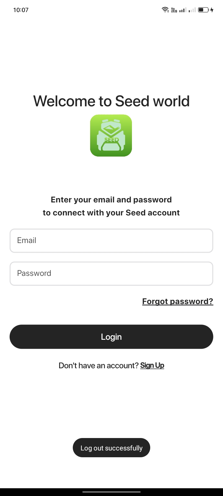
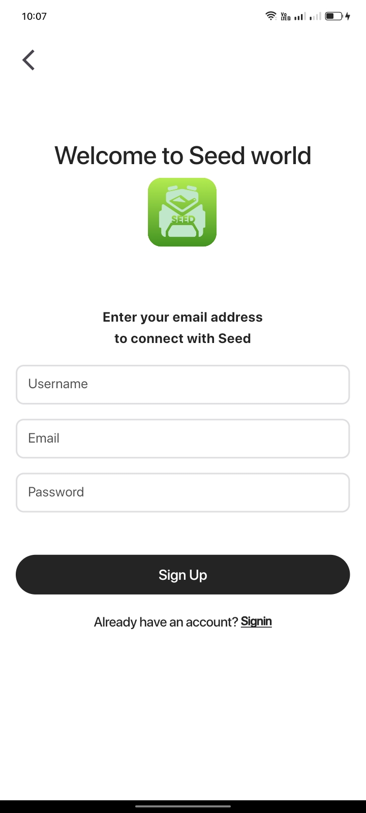
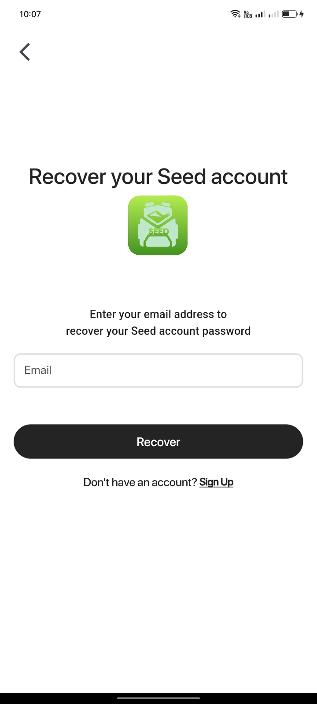
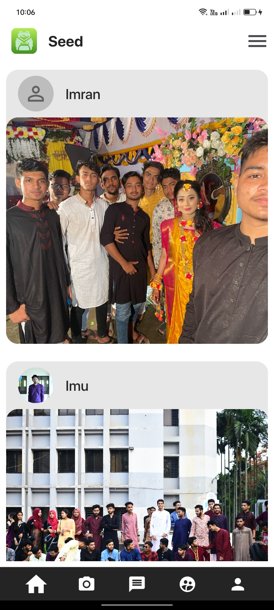
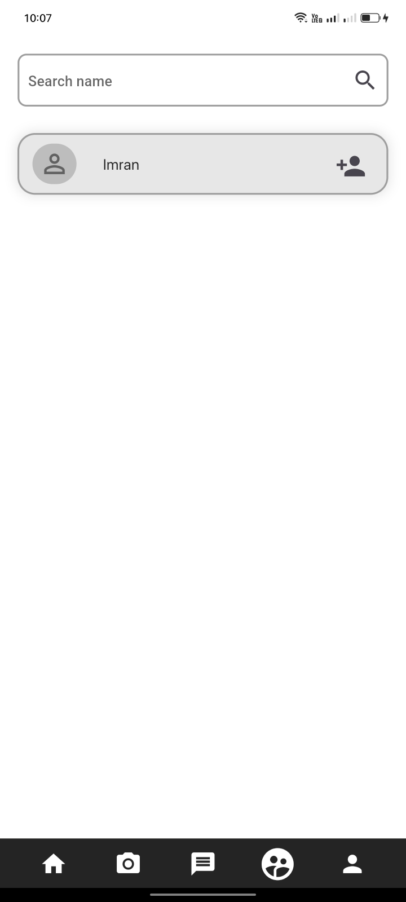
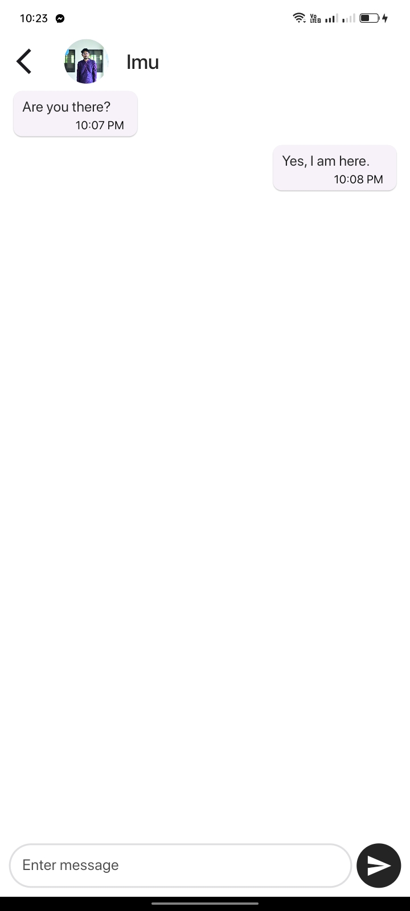
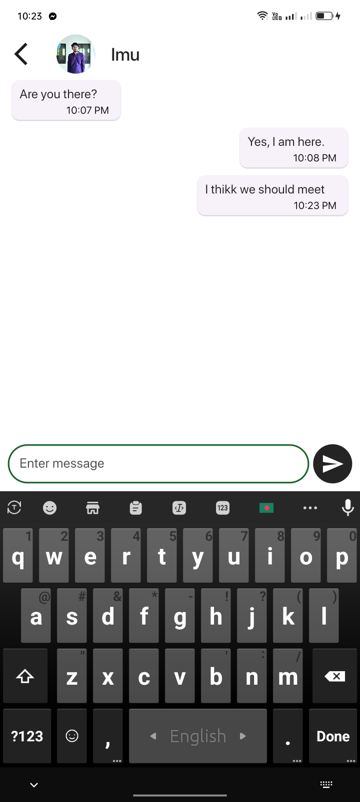

# This is a social media based app

### Here I used
<li>Provider</li>
<li>
    Firebase
        <ul>Login</ul>
        <ul>Signup with gmail verification</ul>
        <ul>Recovery password</ul>
        <ul>Realtime databse</ul>
        <ul>Chatting via realtime database</ul>
</li>
<li>Persistence bottom nav bar</li>

<h3>Login Screen</h3>

<h3>Signup Screen</h3>

<h3>Recovery Screen</h3>

<h3>Home Screen</h3>

<h3>Userlist Screen</h3>

<h3>Message Screen</h3>

<h3>Message Screen</h3>
